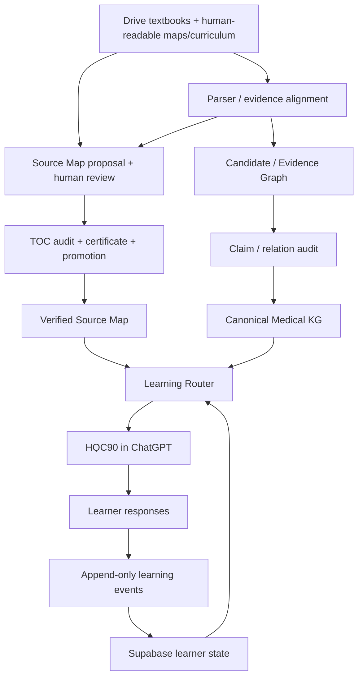

# Medical Learning System

Source-grounded, adaptive medical learning backend for the **Học nền tảng y học** project.

## Current version: v0.10.1

v0.10.1 makes HỌC90 source-aware on top of the v0.10 Book Registry and logical-book Source Map layer:

- **Google Drive** holds original textbooks, learner-approved curriculum, and human-readable Source Map drafts or reviewed mirrors. These maps are reconciled against the textbooks; their presence in Drive does not certify completeness.
- **GitHub** holds machine contracts, retrieval, validation, routing, tests, and migrations.
- **Supabase** is the primary runtime state store for learner state and HỌC90 sessions.
- **ChatGPT** is the teaching interface.
- **Canonical Medical Knowledge** remains separate from Candidate/Evidence data and from learner state.
- **Logical Book Registry** separates one book from its one-or-many physical Drive files.
- **Source Maps** preserve the book/TOC structure and verified locators. Their structural completeness is distinct from each learner's study coverage and concept mastery.
- **HỌC90 blueprints/sessions** carry structured logical-book, Source Map, physical-source and freshness references.

## Architecture



Parser output proposes Source Map structure and locators; a human-readable Drive map can also supply or receive corrections. The original textbook and audited TOC are the authority. Only a certified and promoted map becomes runtime navigation. The Router reads the verified map, validated medical knowledge, and learner state. Learner responses produce events; aggregates such as mastery and observed errors are updated from those events, never from the KG.

## Core invariants

1. Raw textbook PDFs stay out of Git and remain source material in Google Drive.
2. RAG/LLM extraction is evidence, not canonical medical truth.
3. Candidate/Evidence data cannot write directly into the Canonical Medical KG.
4. Promoted medical assertions require source provenance and validation.
5. Student Model, Error Graph, HỌC90 state, and skill-tree state are not medical truth.
6. **Source coverage and concept mastery are separate dimensions.**
7. Learning events are append-only evidence; mastery is not raised merely because content was shown.
8. Large curriculum changes require learner approval; the router may adapt only bounded within-session paths automatically.
9. Current/time-sensitive clinical claims require an explicit current-validity gate before being presented as current standard.
10. Every important answer should remain traceable toward source → passage/figure/table/equation → page/chapter → edition → physical Drive file.

## Adaptive HỌC90 runtime

The target interaction is:

```text
HỌC 90: bắt đầu
```

The runtime resolves the approved curriculum position, resumable session checkpoint, due retrieval, prerequisite gaps, open learner errors, active blueprint, source spine, and required source evidence.

If a session is interrupted, the backend can persist a checkpoint so:

```text
HỌC 90: tiếp tục
```

can resume at the prior concept/question/hint level.

v0.9 stores state incrementally after meaningful learner responses instead of waiting until the end of a 90-minute session.

v0.10 adds `mls_logical_sources` and `mls_source_map_nodes` so split books such as Neumann, Magee, and Katzung can be navigated as one logical source while retaining exact physical-source provenance.

## Supabase runtime

Migration `0009_adaptive_learning_runtime.sql` adds backend-only tables for:

- HỌC90 sessions and checkpoints;
- append-only learning events;
- concept mastery M0-M7;
- learner error history;
- source coverage state;
- skill nodes and learner skill state;
- active HỌC90 blueprints.

The legacy `mls_coverage` table is not silently repurposed because earlier versions mixed book coverage terminology with learner mastery. v0.9 introduces `mls_source_coverage_state` for an individual learner's progress. Source Map completeness instead measures whether required TOC nodes and locators have been verified for a book; neither measure implies `mls_concept_mastery`.

## Retrieval and evidence

The repository already includes:

- Google Drive source materialization;
- native PDF text and parser adapters;
- evidence alignment;
- vector/retrieval evaluation;
- Candidate Graph materialization;
- passage-level claim audit;
- relation-to-claim support and append-only audit ledgers;
- KG v5 migration tooling.

Multimodal evidence types include text, image, table, and equation records. Further figure-region/caption retrieval hardening remains planned.

## Development

```bash
git clone https://github.com/dnma28/medical-learning-system.git
cd medical-learning-system
python -m venv .venv
```

Windows:

```bat
.venv\Scripts\activate
python -m pip install --upgrade pip
pip install -e ".[dev]"
pytest
```

Optional stacks remain separated from the core runtime:

- `.[rag]` — RAG-Anything path
- `.[docling]` — Docling parser path
- `.[markitdown]` — MarkItDown fallback for Office/HTML/EPUB/text documents; PDF uses the native path when `.[pdf-native]` is installed, or Docling when `.[docling]` is installed
- `.[langgraph]` — optional LangGraph orchestration library; no agent runner is started by installation
- `.[pdf-native]` — optional native PDF text/outline helpers; install this extra to use that path
- `.[supabase]` — Supabase backend
- `.[eval]` — Ragas evaluation

## Agent tooling

Coding uses the repository-level Ponytail policy in `AGENTS.md`. Spec Kit, OpenHarness, Superpowers, Open Code Review, Ragas, and Promptfoo remain development/evaluation tooling and cannot override medical provenance or learner-state separation rules.

See:

- `docs/AGENT_STACK.md`
- `docs/QUALITY_STACK.md`
- `docs/THIRD_PARTY_TOOL_EVALUATION.md`
- `docs/V0_9_ADAPTIVE_RUNTIME.md`
- `docs/V0_10_SOURCE_REGISTRY.md`
- `docs/V0_10_1_SOURCE_AWARE_HOC90.md`

## Evidence and graph storage

Drive stores textbook binaries. The backend stores parsed evidence blocks and Source Map staging/runtime records in restricted Supabase tables; local SQLite is used for development and tests. Claim and relation audit records also have Supabase tables. The early Candidate/Canonical Graph exporter writes JSONL to a caller-supplied local path; a durable production graph store and its access/retention policy are still unspecified. Keep any graph export with textbook-derived content in private non-Git storage such as ignored `data/local/`; Git contains schemas and code, not those exports. Do not treat a staging Source Map as certified runtime data.

## Copyright and secrets

Do not commit:

- textbook PDFs;
- parser output containing copyrighted source content;
- local RAG storage;
- API keys;
- Supabase backend credentials;
- `.env` files.
