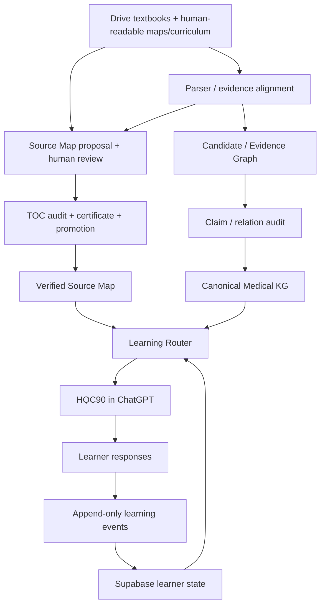

# Architecture v0.10 — Adaptive HỌC90 + Logical Sources

## Responsibility boundaries



Parser extraction and human-reviewed Drive documents both inform Source Map proposals. The textbook and audited TOC control identity, hierarchy and locators. A proposal remains staging until certified and promoted; a human-readable Drive map may be a draft or a mirror of a reviewed map. The KG and verified Source Map inform routing, while learner responses generate the append-only events from which learner aggregates are updated.

## Canonical ownership

- **Google Drive** owns original textbook binaries and human-readable study artifacts.
- **GitHub** owns executable machine contracts, routing logic, migrations, tests, retrieval code, and validation.
- **Supabase** stores live learner/runtime state and backend-only source/evidence, audit, and Source Map staging/runtime records; it is not an automatic KG-to-mastery pipeline.
- **Canonical Medical KG** owns validated medical concepts/relations, not learner state.
- **Candidate/Evidence Graph** owns extracted/proposed evidence before promotion.

## Learning-state separation

Three distinct measures must never be collapsed:

1. **Structural Source Map completeness** — whether the required book/TOC nodes, hierarchy and locators have been verified.
2. **Learner source coverage** — which book/TOC items the learner has studied (`mls_source_coverage_state`).
3. **Concept mastery** — what the learner can independently retrieve, explain, transfer, and retain (`mls_concept_mastery`).

`mls_coverage` from older migrations is preserved for compatibility. v0.9 adds explicit runtime tables rather than silently changing old semantics.

## HỌC90 execution contract

At session start:

1. load approved curriculum position;
2. load resumable checkpoint if present;
3. load Student Model, Error Graph, Skill Tree, and due reviews;
4. load one active blueprint;
5. resolve source spine and required source anchors;
6. run retrieval before new teaching when due;
7. adapt within-session path using the Router.

Within a session, bounded adaptations may occur automatically: prerequisite repair, hint depth, retrieval selection, cross-book support, and transfer difficulty. Large curriculum changes require learner approval.

Meaningful learner responses are persisted immediately as append-only learning events. Aggregate learner state is updated from those events without losing the original evidence trail. KG claims supply teaching content and prerequisites; they do not create observed errors or raise mastery.

## Retrieval rule

Use one **source spine** by default. Add supporting sources only when they materially improve mechanism, resolve a prerequisite, expose a meaningful disagreement, or provide a needed clinical bridge.

Do not load all textbooks or all KG patches for a single lesson.

## Provenance rule

Important teaching claims should remain traceable through:

```text
answer
→ claim
→ evidence block
→ passage / figure / table / equation
→ page / chapter
→ logical book + edition
→ physical Google Drive file
```

## Current-validity gate

Textbook fidelity and present-day clinical validity are separate. Dose, threshold, regimen, guideline, contraindication, monitoring, and similar time-sensitive claims require current verification before being presented as current standard.

## Storage and security

Textbook binaries stay in Drive. Parsed evidence and Source Map proposals/runtime nodes have backend-only Supabase tables, with SQLite as a local development/test implementation. Claim and relation audit records also have Supabase tables. Early Candidate/Canonical Graph JSONL exports use a caller-supplied local path; no durable production graph store or access/retention policy has yet been specified. Textbook-derived exports must stay in private non-Git storage such as ignored `data/local/`. Supabase and Drive credentials remain server-side. Raw copyrighted binaries and extracted corpora are not committed to Git.


## Logical Book Registry and Source Maps

v0.10 introduces an explicit layer between physical files and medical concepts:

```text
Logical Book
  ├─ physical Drive file
  ├─ alternate/split Drive file
  └─ Source Map
       └─ Part → Chapter → Section → Subsection
```

A filename is never sufficient evidence for internal chapter identity. Physical file identity is operational metadata; the logical book identity is stable across renames and split/full representations.

Source Map nodes may point back to a physical `source_id` and page/source anchor. This preserves the traceability chain without forcing the Knowledge Graph to carry book-navigation responsibilities.

Each mapped item has one learning-value class:

- `CORE_MASTERY`
- `SUPPORTING`
- `REFERENCE_ONLY`
- `CURRENT_CLINICAL_CHECK`

`CURRENT_CLINICAL_CHECK` requires a freshness gate. Mapping an item as `REFERENCE_ONLY` does not remove it from source coverage.
